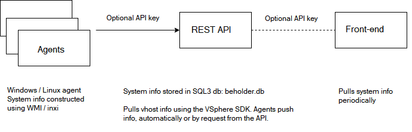
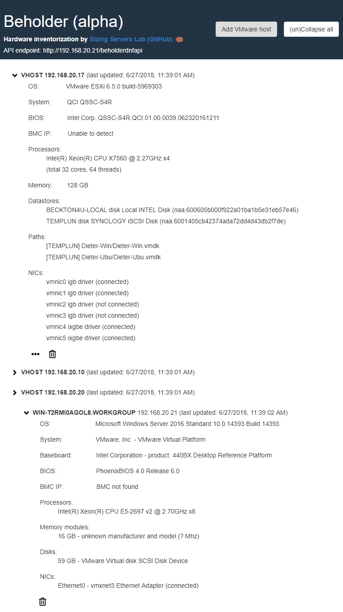

# sizingservers.beholder.frontend
*2018-06-22 - 0.1: First robust implementation.*

*Compatible with sizingservers.beholder.dnfapi 0.1*

    2018 Sizing Servers Lab  
    University College of West-Flanders, Department GKG
    Dieter Vandroemme

This project is part of a computer hardware inventorization solution, together with sizingservers.beholder.api and sizingservers.beholder.agent.

Agents are installed on the computers you want to inventorize. These communicate with the REST API which stores hardware info. The REST API uses the VMware VSphere SDK to gather hardware info about vhosts as well.

The front-end app visualizes all that info.

## Languages, libraries, tools, technologies used and overview
This is a web application build using **bootstrap 3.3.6** and **JQuery 2.2.3**.

Visual Studio Code 1.24.1 is used to build this app; the minify 0.30.0 extensions to minify html, css and js.

main(.min).js contains all communication to the API using AJAX. It also updates the GUI with retrieved system info every 30 seconds.
    
## Configure

### main(.min).js
    var endpoint = "http://localhost:28751";
    var apiKey = "<insert a SHA-512 of a piece of text here>";
    
Set the endpoint directly in the minified js.

## Run
Host it on a web server.